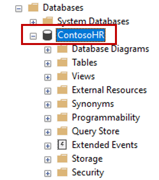
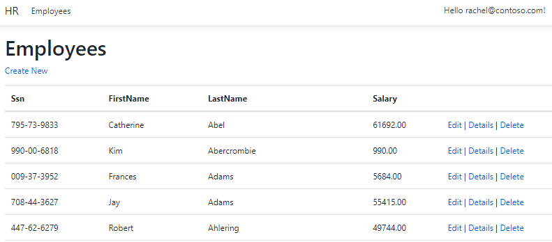

# Ledger Azure SQL Database - Demo

The demo in this folder showcases the [ledger](https://docs.microsoft.com/en-us/azure/azure-sql/database/ledger-overview) feature in Azure SQL Database. The demo uses the Contoso HR web application.

## Content

[About this sample](#about-this-sample)
[Before you begin](#before-you-begin)
[Setup](#setup)
[Demo - show the main benefits of the ledger feature](#Demo---show-the-main-benefits-of-the-ledger-feature)
[Cleanup](#cleanup)

## About this sample

- **Applies to:** Azure SQL Database
- **Key features:** Ledger
- **Workload:** Human resources (HR) application
- **Programming Language:** C#, Transact-SQL
- **Authors:** Jakub Szymaszek, Pieter Vanhove
- **Update history:**

## Before you begin

Before you begin, you need an Azure subscription. If you don't already have an Azure subscription, you can get one for free [here](https://azure.microsoft.com/free/).

You also need to make sure the following software is installed on your machine:

1. PowerShell modules:

   1. Az version 7.2.1 or later. For details on how to install the Az PowerShell module, see [Install the Azure Az PowerShell module](https://docs.microsoft.com/powershell/azure/install-az-ps). To determine the version of the Az module installed on your machine, run the following command from a PowerShell session.

     ```powershell
     Get-InstalledModule -Name Az
     ```

   1. SqlServer version 21.1.18256 or later. For details on how to install the SqlServer PowerShell module, see [Installing or updating the SqlServer module](https://docs.microsoft.com/sql/powershell/download-sql-server-ps-module#installing-or-updating-the-sqlserver-module). To determine the version the SqlServer module installed on your machine, run the following command from a PowerShell session.

     ```powershell
     Get-InstalledModule -Name SqlServer
     ```

2. [Bicep](https://docs.microsoft.com/en-us/azure/azure-resource-manager/bicep/overview?tabs=bicep) version 0.4.1272 or later. You need to install Bicep and ensure it can be invoked from PowerShell. There are several ways to [install Bicep](https://docs.microsoft.com/en-us/azure/azure-resource-manager/bicep/install).
3. [SQL Server Management Studio (SSMS)](https://msdn.microsoft.com/en-us/library/mt238290.aspx) - version 18.11 or later is required.

## Setup

By following the below setup steps, you will create a new resource group and deploy the following resources to your Azure subscription:

- A logical database server.
- The **ContosoHR** database using Serverless General Purpose compute tier, 1 vCore, and the Gen5 hardware generation.
- A storage account that will be used to store ledger digests.
- The Contoso HR web application in Azure Web Apps.

### Setup steps

1. Clone/download and unpack the repository.
1. Open a PowerShell session.
1. In the PowerShell session, change the directory to the setup folder within this demo's directory. For example, if you've unpacked the downloaded repository on a Windows machine in **C:\\**, issue the following command:

   ```powershell
   cd "C:\sql-server-samples\samples\features\security\ledger\azure-sql-database\setup"
   ```

1. Run the **setup.ps1** PowerShell script.
1. When prompted, enter the following information:
   1. Your Azure subscription id. To determine your subscription id, see [Find your Azure subscription](https://docs.microsoft.com/azure/media-services/latest/setup-azure-subscription-how-to?tabs=portal).
   1. The project name. The resource group containing all your demo resources will have that name. The project name will also be used as a prefix for the names of all demo resources. Please use only lowercase letters and numbers for the project name and make sure it is unique.
   1. The location - an Azure region name of your choice. See [Find the Azure geography that meets your needs](https://azure.microsoft.com/en-us/global-infrastructure/geographies/#overview).
   1. The username and the password of the Azure SQL database server administrator. **Make sure you remember both the username and the password.** You will use it during the demo to match a fictitious attacker's name.
1. When prompted, sign in to Azure.
1. The script will deploy the demo environment, which may take a few minutes. If you want to monitor the deployment process, go to the [Azure Portal](https://portal.azure.com/) and open the resource group that is used for the demo environment. In the overview tab, click on the link next to **Deployments**.
1. Finally, the script outputs the important information about your demo environment.
   - Database server name (`<project name>server.database.windows.net`)
   - Database name (`ContosoHR`)
   - Application URL (`https://<project name>app.azurewebsites.net/`)

   Please copy and save the above information. You will need it for the demo steps.

## Demo - show the main benefits of the ledger feature

### Scenario

The HR department of Contoso is using a simple web application to manage the employee's salaries.
In this demo you will use 3 different types of users:

- Rachel, who works at the HR department.
- Alice, who is an auditor.
- Jay, the DBA of the company. He thinks he should earn more money for the type of work he's doing :)  

Jay wants to maliciously increase his salary. Because he's the DBA of the Contoso database, he thinks he can perform updates in the Employees table without anyone noticing. Unfortunately for Jay, the Employees table is an updatable ledger table, which means his change, along with his identity and the timestamp, have been persisted in a tamper-evident ledger data structures.

### Prepare for the demo

Perform the below steps before you show the demo.

1. Connect to the database
   1. Start the SQL Server Management Studio.
   1. In the **Connect to Server** dialog:
      1. Enter your database server name. Set **Authentication** to **SQL Server Authentication**. Enter the admin username and the admin password.
      1. Click the **Options >>** button, select the **Connection Properties** tab and enter the database name (**ContosoHR**).

         

      1. Click **Connect**.

1. Prepare a browser window for the HR user.
   1. Open your browser.
   1. Point the browser to the demo application URL.
   1. Log on as rachel@contoso.com. The password is: Password!1
   1. Leave the ContosoHR tab selected.

1. Prepare a web browser for the Auditor user.
   1. Open a [Private Browsing](https://en.wikipedia.org/wiki/Private_browsing) window.
   1. Point the browser to the demo application URL.
   1. Log on as alice@contoso.com. The password is: Password!1
   1. You should now see 5 tabs. Leave the ContosoHR tab selected.

1. Open the demo queries in SSMS.
   1. In Object Explorer, find and select the **ContosoHR** database.

        

   1. With the **ContosoHR** database selected, type Ctrl + O. In the **Open File** dialog, navigate to the **setup** folder and select **CreateDatabaseSchema.sql**. Do not execute the query.
   1. With the **ContosoHR** database selected, type Ctrl + O. In the **Open File** dialog, navigate to the **tsql-scripts** folder and select **UpdateSalary.sql**. Do not execute the query yet.
   1. With the **ContosoHR** database selected, type Ctrl + O. In the **Open File** dialog, navigate to the **tsql-scripts** folder and select ***ListAllEmployees.sql**. Do not execute the query.

1. *Optional* - If you've showed this demo before, reseed the database to ensure it contains the original employee data.
   1. In Object Explorer, find and select the **ContosoHR** database.
   1. With the **ContosoHR** database selected, click Ctrl + O. In the **Open File** dialog, navigate to the **setup** folder and select **PopulateDatabase.sql**.
   1. Execute the query.  
      **Note:** for best demo results, wait 10 minutes after reseeding the database. This will ensure the **Employee Ledger Entries** and **Audit Events** tabs in the app (Auditor's browser) do not show reseeding queries.
   1. You can close the **PopulateDatabase.sql** tab.

### Demo steps

1. Show the app and the database.
   1. Show the Contoso HR web app in the HR user's browser. Click on the **Employees tab**. This application displays employee records, and allows HR staff members to manage employee records.
   
   1. Switch to SSMS, select the **ListAllEmployees.sql** tab and execute the query, which shows the content of the **Employees** table. The web application uses this table as a data store.  

1. Show how ledger helps investigate tampering by DBAs.
   1. Point to Jay’s record in the table (row #4). Let's assume Jay is both the DBA of the ContosoHR database as well as an employee of Contoso. Jay wants to maliciously increase his salary.
   1. Pretending you are Jay, switch to SSMS, select the **UpdateSalary.sql** and execute the query.
   1. In HR user’s (Rachel's) browser window, refresh the content of the **Contoso HR** tab. Point to Jay’s record to show the HR application shows Jay’s updated salary.
   1. Switch to SSMS. Select the **CreateDatabaseSchema.sql** tab and show the CREATE TABLE statement for the **Employees** table. (Once SSMS supports scripting ledger tables, generate and show the CREATE TABLE statement for the Employees table instead.) Unfortunately for Jay, the **Employees** table is an updatable ledger table, which means his change, along with his identity and the timestamp, have been persisted in a tamper-evident ledger data structures.
   1. Switch to auditor’s (Alice's) browser window and select the **Ledger Verifications** tab. Let's assume, a few weeks later, Alice, who is an auditor, performs a routine review of changes in the HR database. As her first step, Alice runs the ledger verification to make sure she can trust the data, she’s going to examine. The result should be "Success" like the screenshot below.
   
   1. Select the **Employee Ledger** tab. In the **Employee Ledger** tab, Alice can browse the content of the ledger view for the **Employees** table. She notices a suspicious update operation performed by Jay, who will not be able to effectively deny he has updated his salary, because the data in the ledger table has been cryptographically verified as genuine and it clearly shows Jay updated his salary.
   
   1. Switch to SSMS. Select the **CreateDatabaseSchema.sql** tab and show the stored procedures (that are used by the web application):
       1. **VerifyLedger** - Explain the sys.sp_verify_database_ledger_from_digest_storage procedure
       1. **GetEmployeeLedgerEntries** - Explain the view Employees_Ledger and table sys.database_ledger_transactions

1. Show how ledger helps investigate tampering by malicious application users.
   1. Switch to HR user’s (Rachel’s) browser to execute a different attack scenario. This time, you will perform an authorized salary change acting as a malicious HR staff member - Rachel. Click the **Employees** tab and find Frances' record in row 3 (you can pick another employee record if you want). Click the **Edit** link for Frances' record, enter a new salary value and click **Save**.
   1. Switch to Auditor’s browser window. Select and refresh the **Employee Ledger** tab. When Alice, the auditor, performs her next review of changes in the HR database, she again notices a suspicious salary update. However, this time the **User Name** column does not tell Alice who performed the update, because the column contains the managed identity of the web application, not the identity of the application user.
   
   1. This time, the attacker, Rachel, is out of luck too, because the Contoso HR web application has been instrumented to write all SQL update queries, triggered by its users against the **Employees**  table, to an append-only ledger table – **AuditEvents**. Switch to SSMS. Select the **CreateDatabaseSchema.sql** query tab and show the CREATE TABLE statement for the **AuditEvents** table. (Once SSMS supports scripting ledger tables, generate and show the CREATE TABLE statement for the **AuditEvents** table instead.)
   1. Go back to Auditor’s browser window. When Alice views the content of the **AuditEvents** table, she finds the corresponding Transact-SQL update statement, Rachel triggered. Since Transact-SQL statements are stored in a ledger table, and are therefore protected from tampering, Rachel will be unable to effectively deny she has made the change.
   

### Key Takeaways

Ledger makes your data tamper-evident and cryptographically verifiable, which helps ensure non-repudiation, eliminating a need to run laborious manual audits and time-consuming investigations.

## Cleanup

To permanently remove all demo resources:

1. Run the **cleanup.ps1** PowerShell script in the setup folder.
1. When prompted, enter your demo resource group name and your subscription id, and sign in to Azure.
1. Confirm you want to delete resource group.
